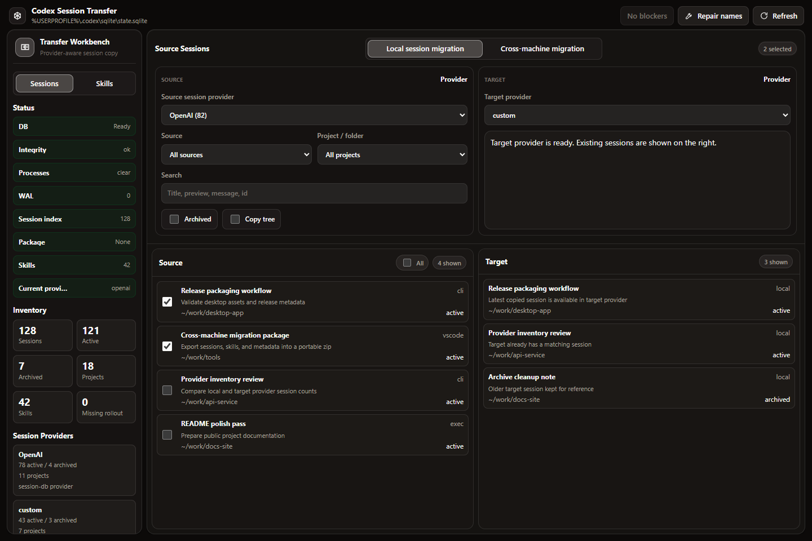

# Codex Session Transfer

<p align="center">
  <strong>A local-first desktop workbench for moving Codex sessions and skills across providers and machines.</strong>
</p>

<p align="center">
  <a href="https://github.com/phenixnull/codex-session-transfer/actions/workflows/release-build.yml"></a>
  
  
  
  
</p>



Codex Session Transfer gives you a focused UI for inspecting local Codex provider sessions, previewing copy plans, exporting portable transfer packages, and importing sessions or skills into another Codex environment. The app runs against local files only: the Electron shell launches a local Python server, and the browser UI talks to `127.0.0.1`.

## Highlights

- **Provider-aware session migration** - copy sessions between detected model providers, including copies within one provider, without hand-editing the SQLite store.
- **Stable provider identity** - provider labels show the configured display name together with the real session-database id, so aliases such as `xixiapi (id: custom)` stay unambiguous.
- **Cross-machine transfer packages** - export selected sessions into a zip package, load it on another machine, and map sessions into existing custom Codex workspaces before import.
- **Responsive compact layout** - scroll the main workbench on short desktop displays and use bounded session lists on narrow screens.
- **Skills migration** - export, load, preview, and import Codex skills with overwrite control.
- **Optional copy plans** - copy sessions directly with live progress, or inspect a plan first without rendering thousands of rows at once.
- **Paged previews** - the preview pane requests 48 plan items at a time and loads the next page only when you scroll.
- **Local safety checks** - show database integrity, WAL files, blocking Codex processes, and session index status before write operations.
- **Desktop packaging** - build Windows and macOS desktop artifacts with Electron Builder and the included release workflow.

## Quick Start

```bash
git clone https://github.com/phenixnull/codex-session-transfer.git
cd codex-session-transfer
npm ci
npm run dev
```

`npm run dev` starts Electron. In development mode, Electron starts `server.py` automatically and opens the UI at `http://127.0.0.1:8765`.

To run only the local web server:

```bash
npm run server
```

Then open `http://127.0.0.1:8765` in a browser.

## Cross-Machine Workspace Mapping

After loading a session package, select the sessions to import and choose how their source projects map onto the destination machine:

- **Preserve projects** maps each source project to `<target root>/<source project name>`.
- **Single workspace** maps every selected source project to the target root itself.
- **Project override** replaces the computed destination for one source project when names collide or a project belongs elsewhere.

The Electron app provides a native folder picker. Browser users can type the absolute target path. Every target directory must already exist and must be a directory; preview reports missing paths and same-name collisions before import.

Workspace mapping updates the imported session's current Codex identity and working-directory metadata consistently in SQLite and rollout metadata. It does not copy repositories, project files, or dependencies, and it does not rewrite historical message text, command records, tool output, or earlier turn-context paths.

## Data Locations

The server resolves Codex data from the current user at runtime:

| Data | Default |
| --- | --- |
| Codex home | `CODEX_HOME` or `~/.codex` |
| SQLite home | `CODEX_SQLITE_HOME`, otherwise the newest `state_5.sqlite` under `~/.codex` or `~/.codex/sqlite` |
| Session database | `state_5.sqlite` |
| Session index | `~/.codex/session_index.jsonl` |
| Transfer packages | Selected project `exported/` folder by default, or `~/.codex/session-transfer/packages` when no single project is selected |
| Transfer manifests | `~/.codex/session-transfer/manifests` |
| Skill packages | `~/.codex/session-transfer/skill-packages` |

## Build

Generate icons and package the desktop app:

```bash
npm run icons
npm run release:win
```

macOS packages are built on macOS:

```bash
npm run release:mac
```

Release assets are collected under `release/v*/`. The GitHub Actions workflow packages Windows and macOS builds and publishes assets when a `v*` tag is pushed.

## Test

```bash
npm test
python -m unittest discover -s tests -p "test_*.py"
```

## Project Layout

```text
electron/   Electron main process and desktop shell
static/     Browser UI served by the local Python server
server.py   Local API for sessions, packages, skills, and safety checks
scripts/    Build, icon, and release collection helpers
tests/      Unit tests for transfer, package, and skills behavior
release/    Locally collected release artifacts
```

## Safety Model

Codex Session Transfer is designed as a local maintenance tool. It does not upload session data to an external service. Write operations are explicit, previewable, and scoped to the current user's Codex directories. When the app detects running Codex processes that may hold database locks, it surfaces them before allowing repair or copy actions.
